# Diagramas de Atividades — Decifra.IA

Diagramas em [Mermaid](https://mermaid.js.org/), renderizados automaticamente pelo GitHub — sem necessidade de imagens exportadas.

---

## US01 — Introdução narrativa
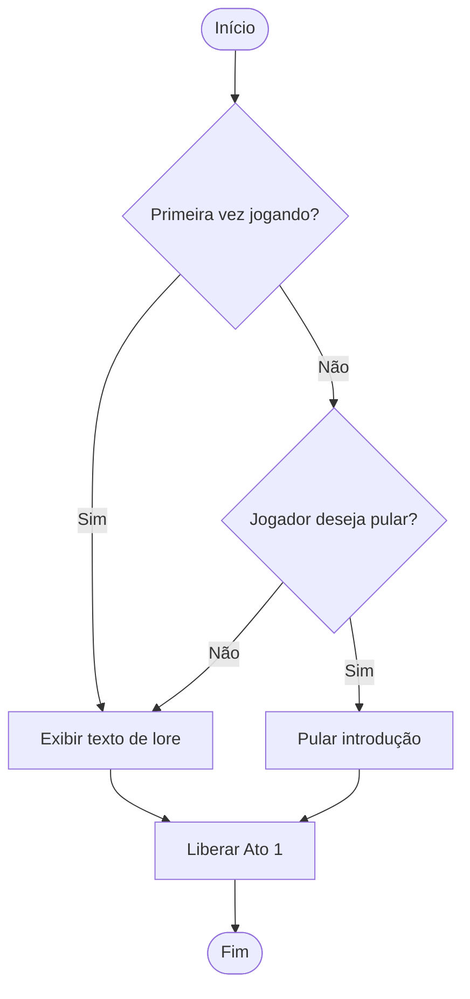

---

## US02 — Quiz conceitual (Manual de Treinamento)
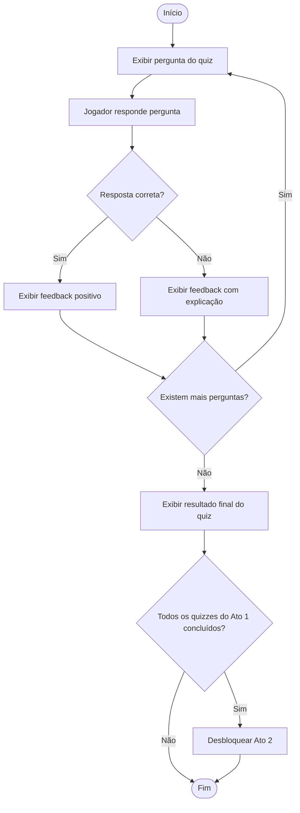

---

## US03 — Desbloqueio de níveis por progresso
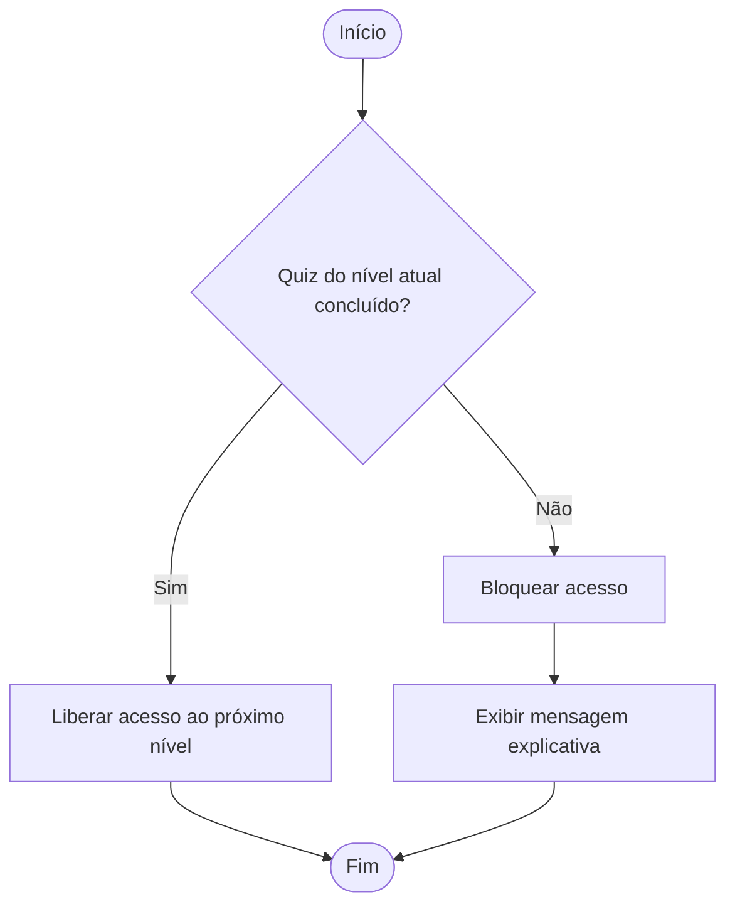

---

## US04 — Geração de chamados por turno
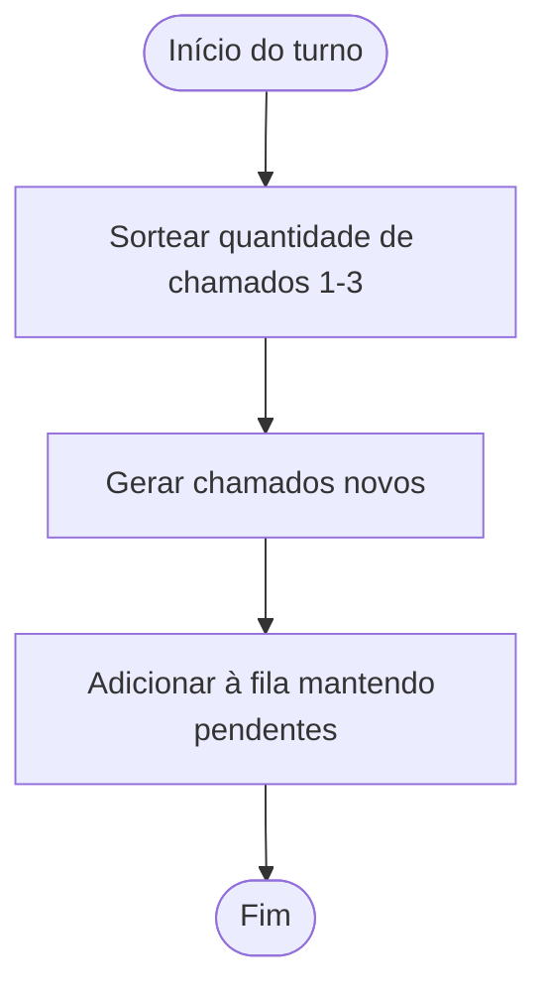

---

## US05 — Fila de priorização de chamados
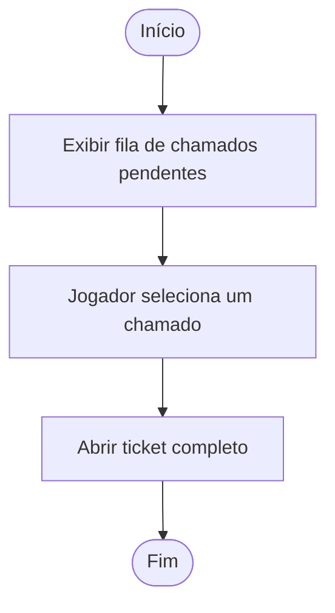

---

## US06 — Exibição do ticket de chamado
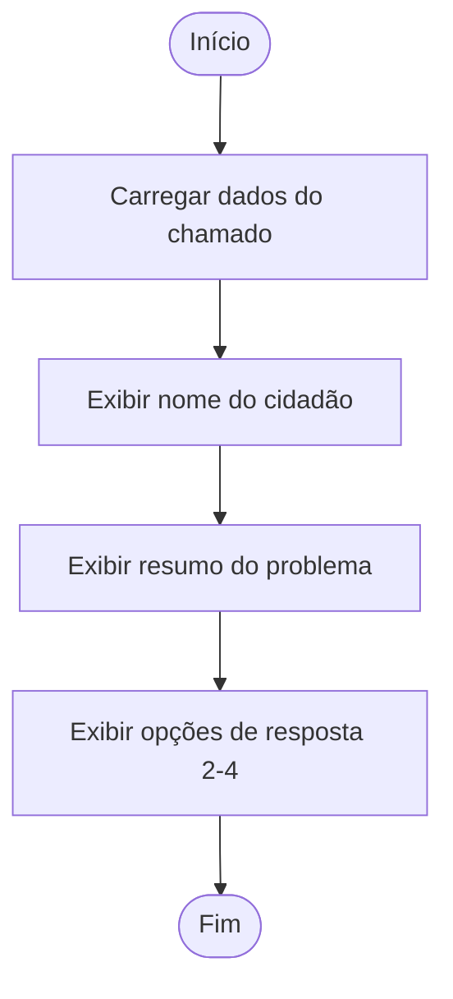

---

## US07 — Escolha de resposta com custo/benefício
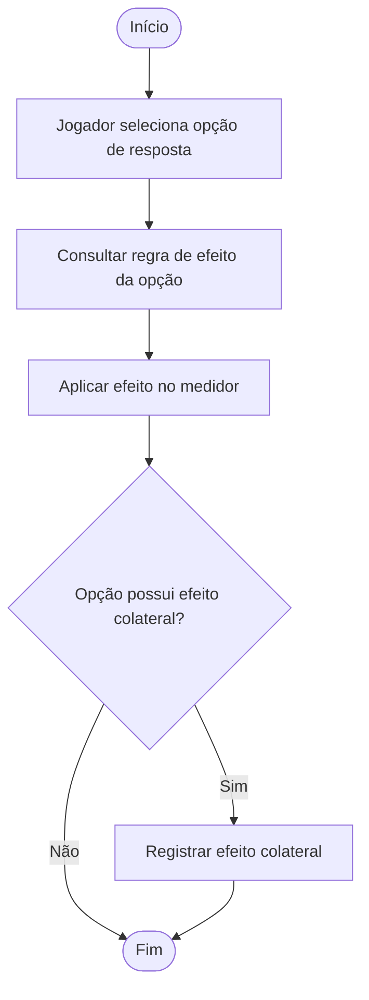

---

## US08 — Feedback imediato após decisão
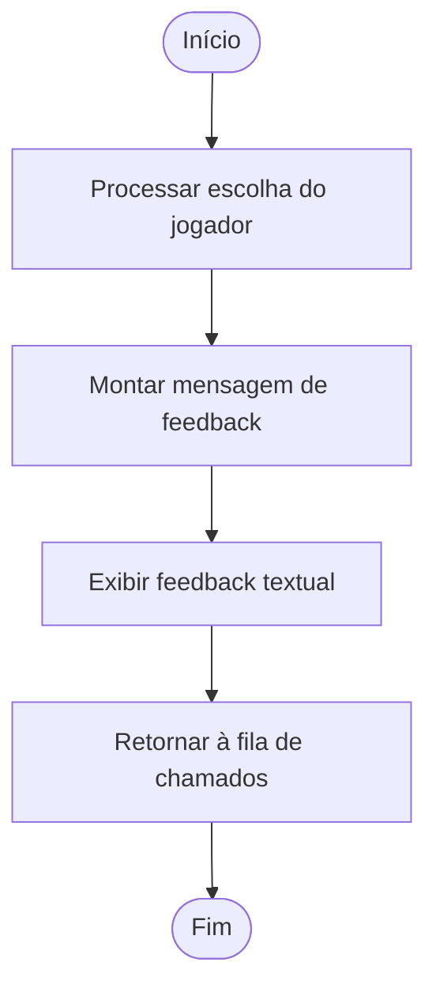

---

## US09 — Medidor de Confiança Pública
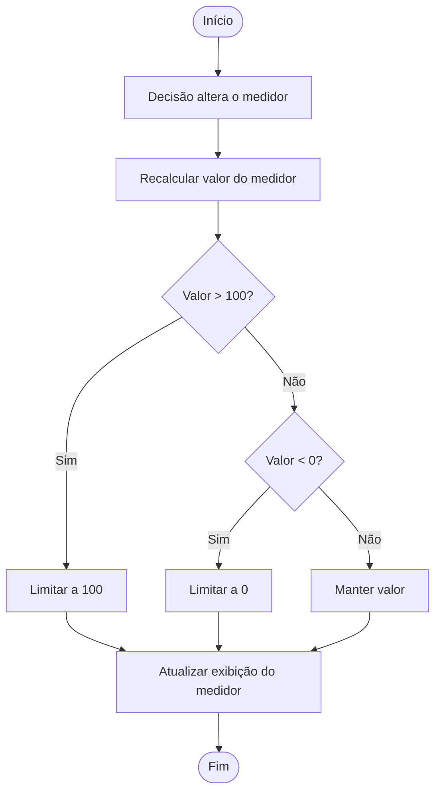

---

## US10 — Resumo do dia (dashboard ASCII)
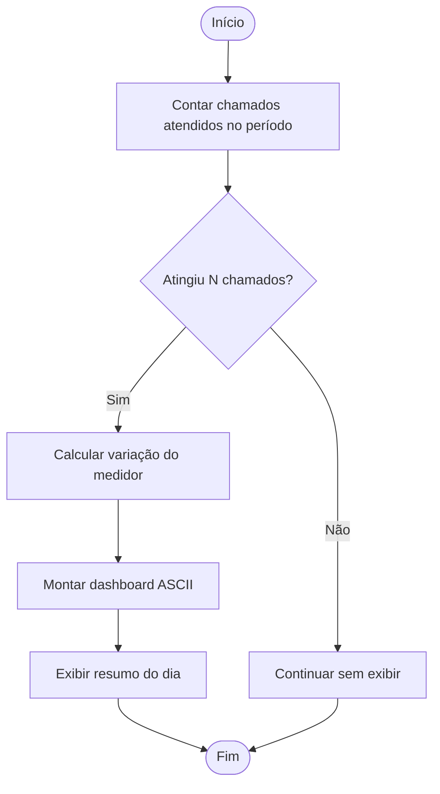

---

## US11 — Persistência de progresso em arquivo binário
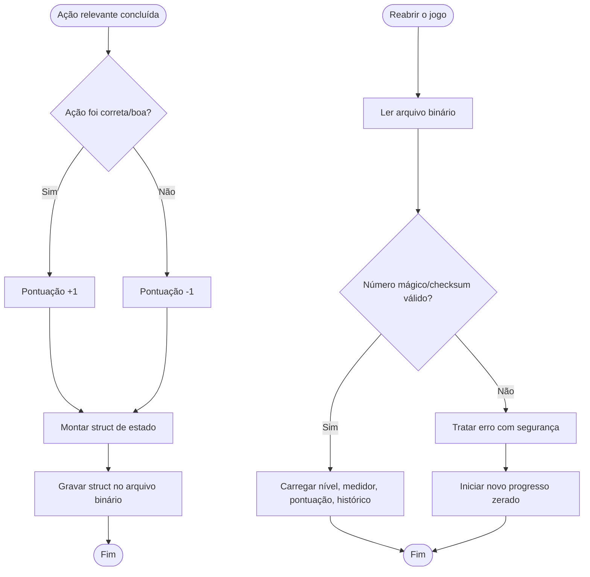

---

## US12 — Gatilho narrativo do escândalo (Ato 3)
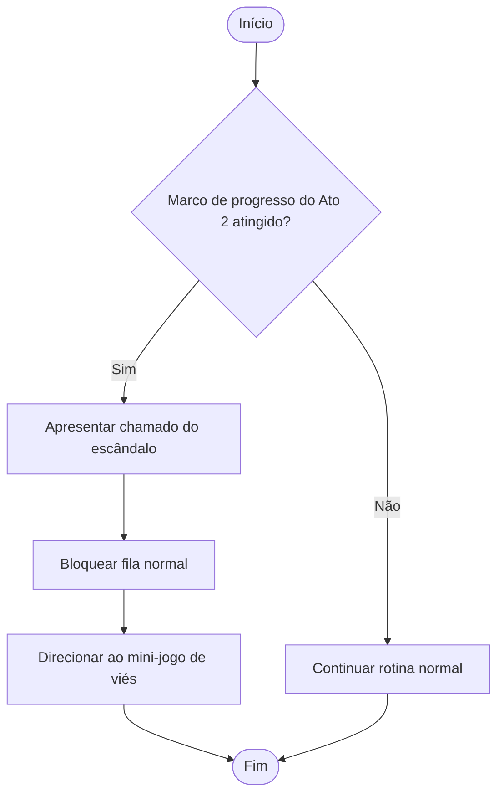

---

## US13 — Mini-jogo de viés: montagem do dataset
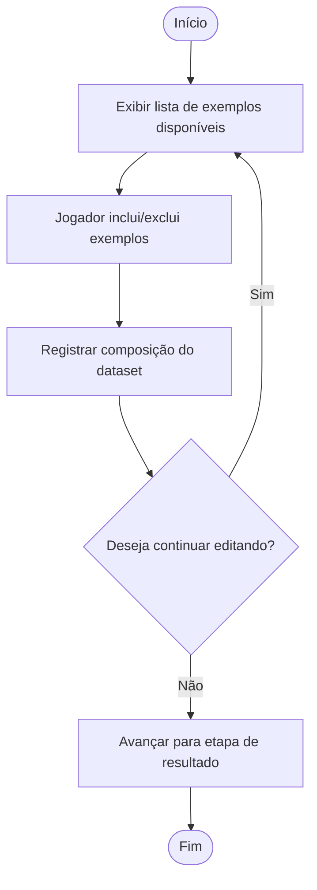

---

## US14 — Mini-jogo de viés: visualização do resultado
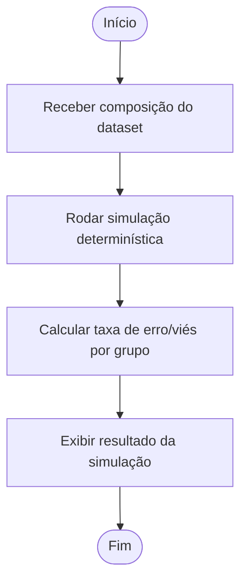

---

## US15 — Conclusão do Ato 3 e efeito no medidor
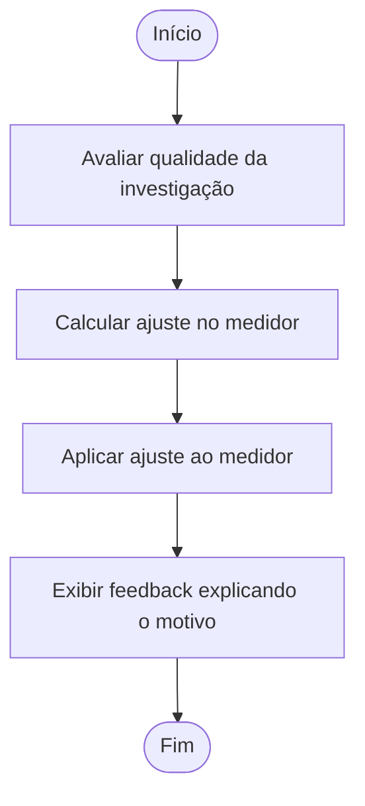

---

## US16 — Cálculo do final (Ato 4)
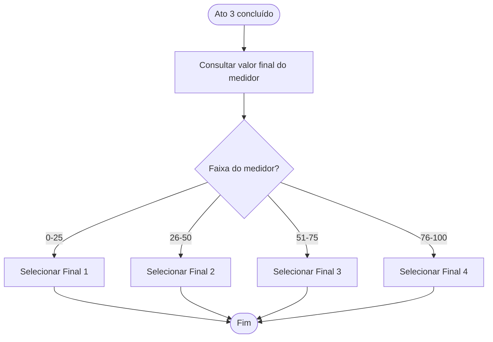

---

## US17 — Exibição do final da história
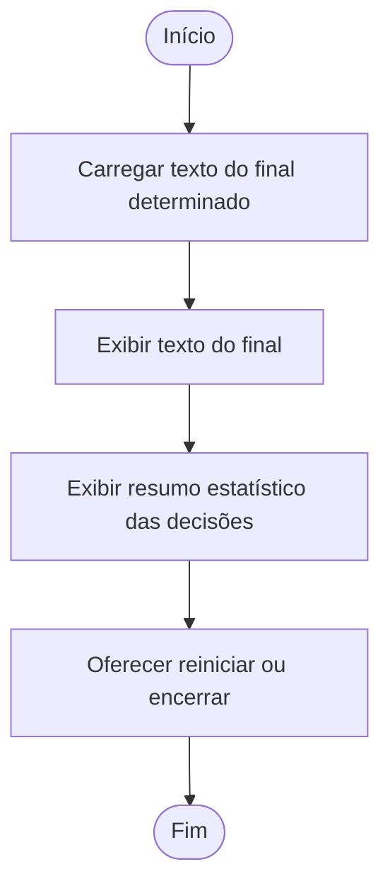

---

## US18 — Reinício de partida com progresso zerado
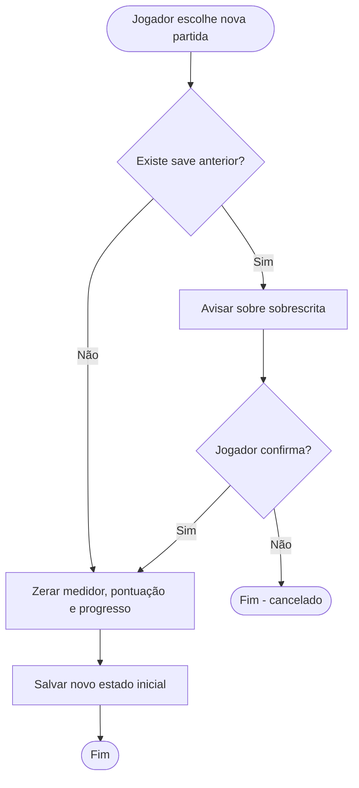
